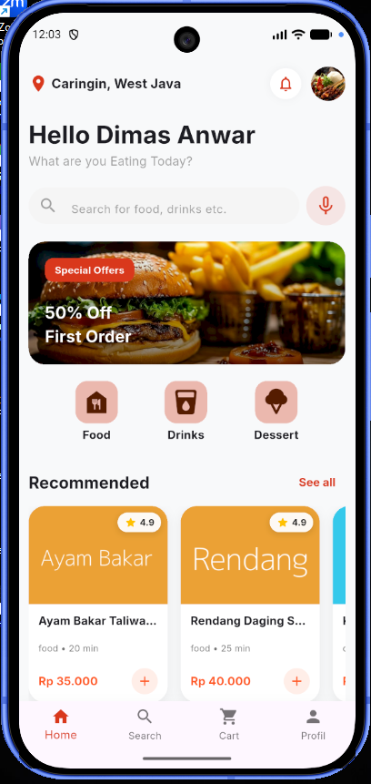
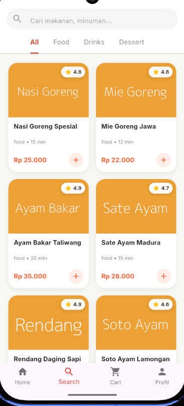
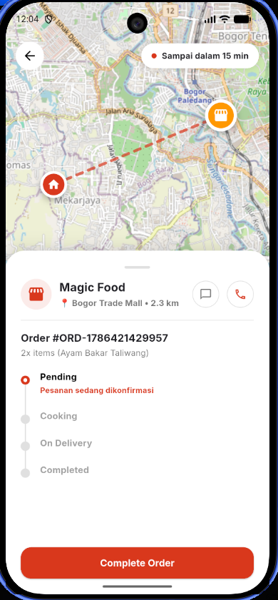
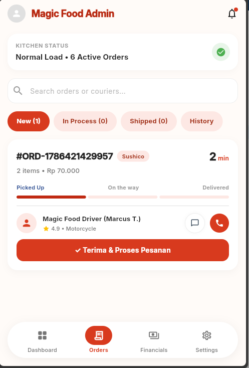
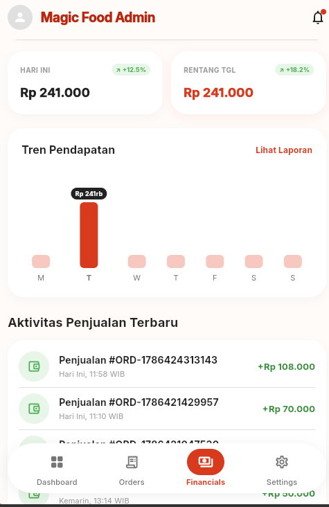

# Magic Food Restaurant Application

Magic Food is a comprehensive, production-grade restaurant management and food ordering application built with Flutter and Supabase. The system delivers a seamless end-to-end experience for both customers and restaurant administrators, featuring real-time order tracking, customer-admin communication, financial analytics, dynamic vouchers, and multi-language support.

---

## Technical Stack

| Domain | Technology / Library | Description |
| :--- | :--- | :--- |
| **Framework** | Flutter (Dart SDK 3.x) | Cross-platform UI toolkit for iOS, Android, Web, and Desktop |
| **Backend Service** | Supabase | PostgreSQL Database, Authentication, and Realtime Engine |
| **Architecture** | Clean Architecture | Layered architecture separating Core, Domain Models, Data, and Presentation |
| **State Management** | ChangeNotifier / ListenableBuilder | Reactive, lightweight state propagation across app features |
| **Localization** | Custom Language Service | Persistent multi-language switcher supporting Indonesian and English |
| **Notifications** | Local Notification Service | Device notification integration and unread status tracking |
| **Reporting & Export** | Custom PDF Print Service | Thermal receipt generator and PDF export utility |

---

## Core Capabilities

### Customer Experience
- **Interactive Food Catalog**: Categorized menu browsing with ratings, search functionality, and formatted local pricing.
- **Cart & Checkout Engine**: Shopping cart management with real-time price calculation, coupon/voucher validation, and shipping address entry.
- **Order Tracking**: Visual status timeline tracking order progress from preparation to courier delivery.
- **Real-Time Customer Support**: Direct chat interface connected with restaurant administration via Supabase Realtime with automated fallback mechanisms.
- **Loyalty Rewards**: Automated point accumulation upon successful order completion.

### Administrator Dashboard ("Magic Food Admin")
- **Kitchen Operational Dashboard**: Overview of active kitchen workload, queue counts, and urgent order alerts.
- **Order Processing & Courier Dispatch**: Multi-stage order state management (Pending, Cooking, On Delivery, History) with courier assignment and live delivery tracking.
- **Real-Time Order Chat**: Dedicated admin chat portal for instantaneous customer communication.
- **Financial Analytics**: Interactive revenue metrics (Today vs. Date Range totals), weekly revenue trend bar charts, and dynamic date range pickers.
- **Sales Activity Log**: Real-time log of customer transactions directly synchronized with database records.
- **Print & PDF Receipt Generator**: On-demand thermal receipt preview and PDF export for order archiving.
- **System Settings**: Restaurant profile management, sound notification alerts, auto-accept toggles, and language preferences.

---

## Application Screenshots

### Customer Application Interface
| Homepage & Recommendations | Menu Catalog & Search | Order Tracking & Map (BTM) |
| :---: | :---: | :---: |
|  |  |  |

### Administrator Dashboard ("Magic Food Admin")
| Orders Management & Driver Dispatch | Real-Time Financial Analytics |
| :---: | :---: |
|  |  |

---

## System Architecture & Directory Structure

The repository follows standard Clean Architecture principles to ensure maintainability, scalability, and code separation.

```text
lib/
├── core/
│   ├── models/            # Shared domain models (OrderData, ChatMessageItem, FoodModel)
│   ├── services/          # Singleton services (ChatService, CartService, LanguageService, NotificationService)
│   ├── theme/             # Design tokens, color palettes, and global typography
│   └── widgets/           # Reusable UI components (FoodCard, AnimatedTouchable)
├── features/
│   ├── admin/             # Administrator Dashboard feature set
│   │   ├── data/          # Admin data repository and analytics calculation logic
│   │   ├── models/        # Financial and courier domain models
│   │   └── presentation/  # Admin tabs, header, bottom navigation, and receipt dialogs
│   ├── dashboard/         # Customer dashboard, order history, tracking, and chat pages
│   ├── home/              # Homepage, categories, banners, and search components
│   ├── onboarding/        # Initial onboarding screens
│   ├── profile/           # User account details, notifications, points, and settings
│   └── splash/            # Application splash initialization screen
└── main.dart              # Application entry point and global provider bindings
```

---

## Database Schema Overview

The backend relies on PostgreSQL hosted on Supabase:

### `menu_items` Table
- `id` (int8, Primary Key)
- `nama` (text)
- `kategori` (varchar)
- `harga` (int4)
- `lama_pembuatan_menit` (int4)
- `rating` (numeric)
- `image_url` (text)
- `created_at` (timestamptz)

### `orders` Table
- `id` (uuid, Primary Key)
- `user_id` (uuid, Foreign Key -> auth.users.id)
- `order_number` (varchar)
- `status` (varchar: `pending`, `cooking`, `on_delivery`, `completed`, `cancelled`)
- `total_price` (numeric / int4)
- `alamat_pengiriman` (text)
- `catatan` (text)
- `created_at` (timestamptz)

### `order_items` Table
- `id` (uuid, Primary Key)
- `order_id` (uuid, Foreign Key -> orders.id)
- `nama_makanan` (varchar)
- `jumlah` (int4)
- `harga_satuan` (numeric)
- `subtotal` (numeric)

### `order_chats` Table
- `id` (uuid, Primary Key)
- `order_id` (uuid, Foreign Key -> orders.id)
- `sender_id` (uuid, Foreign Key -> auth.users.id)
- `message` (text)
- `created_at` (timestamptz)

---

## Getting Started

### Default Administrator Credentials
- **Email**: `admin@gmail.com`
- **Password**: `123456`
- **Role**: `ADMIN`

### Prerequisites
- Flutter SDK (version 3.19.0 or higher)
- Dart SDK (version 3.3.0 or higher)
- Android Studio / VS Code with Flutter extension
- Active Supabase project with Database and Authentication enabled

### Installation

1. Clone the repository:
   ```bash
   git clone https://github.com/DimasAnwar/RestaurantApp.git
   cd restauran_app
   ```

2. Install dependencies:
   ```bash
   flutter pub get
   ```

3. Configure Supabase Credentials:
   Ensure `lib/main.dart` or environment configurations contain your valid Supabase Project URL and Anon Key:
   ```dart
   await Supabase.initialize(
     url: 'YOUR_SUPABASE_URL',
     anonKey: 'YOUR_SUPABASE_ANON_KEY',
   );
   ```

4. Run the application:
   ```bash
   flutter run
   ```

---

## Code Quality & Verification

To verify static analysis and ensure zero linting errors across the codebase, execute:

```bash
flutter analyze
```

To execute unit and widget tests:

```bash
flutter test
```
